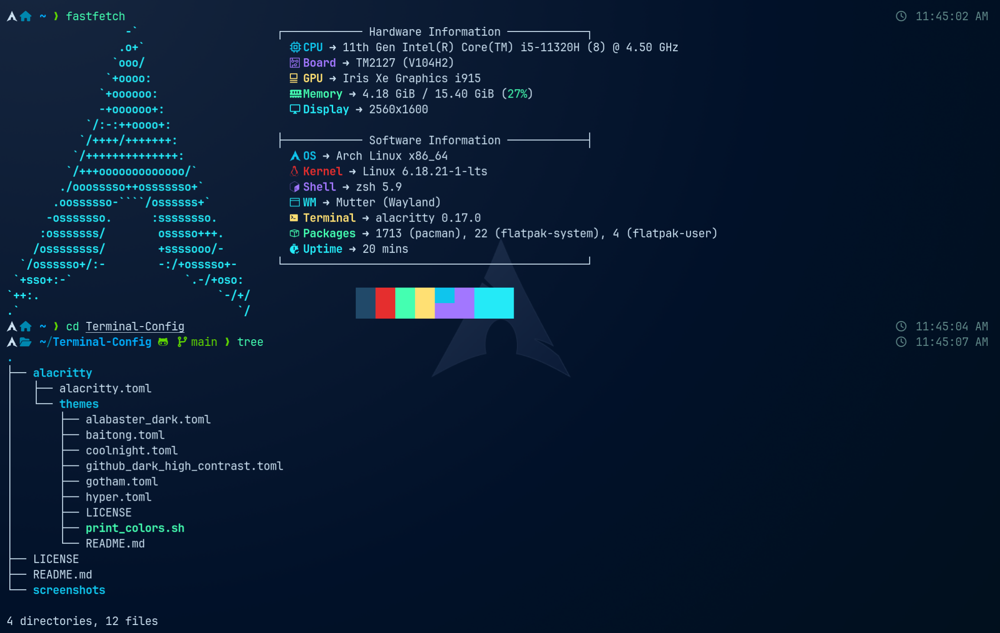
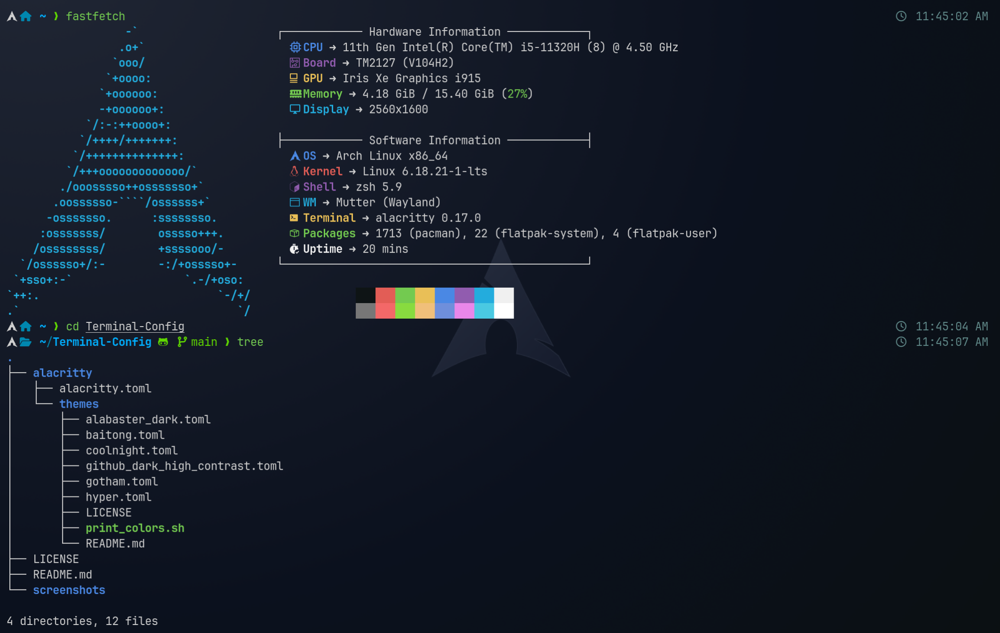
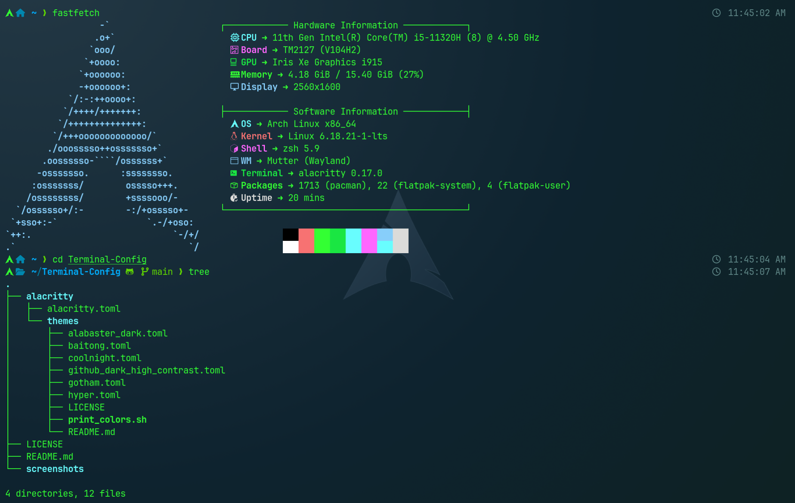
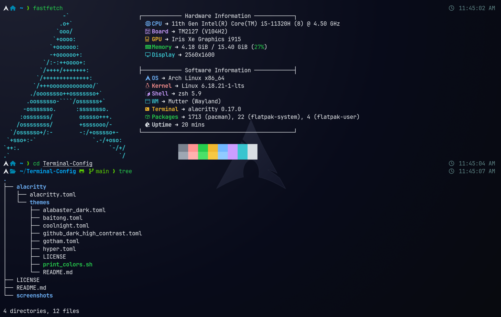
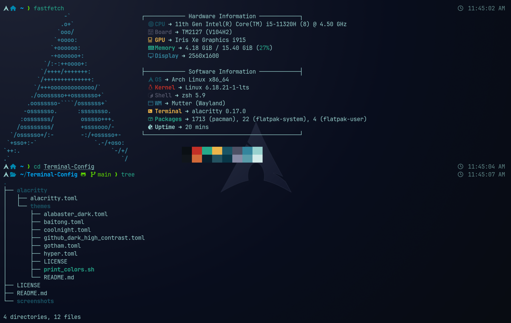
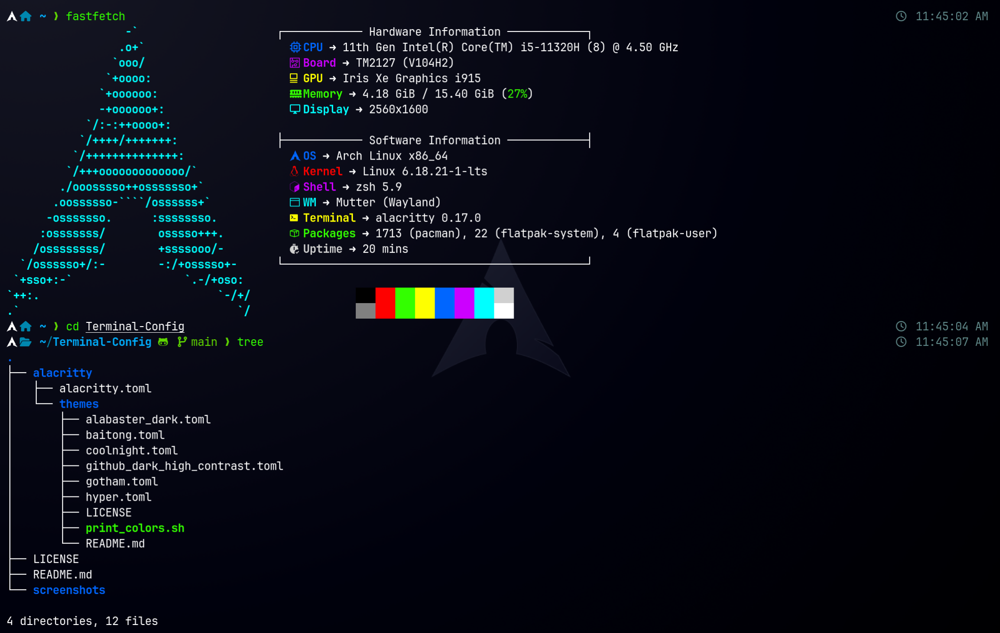

# Terminal Config

A clean, minimal, and fast **Alacritty terminal configuration setup** with ready-to-use themes and a simple structure for quick installation.

This repo is built for people who want a **fast, modern, distraction-free terminal** without spending hours configuring everything manually.

---

## This repository provides:

* Pre-configured **Alacritty terminal settings**
* A collection of **ready-to-use color themes**
* A clean **toml-based configuration system**

Everything is structured to be **plug-and-play**.

---

## Why Alacritty Terminal?

Alacritty is used because:

* Extremely fast (GPU accelerated)
* Minimal and distraction-free
* Fully configurable via TOML
* Perfect for developers who value speed + simplicity

---

## 📁 Repo Structure

```
terminal-config/
│
├── alacritty/
│   ├── alacritty.toml
│   └── themes/
│       ├── alabaster_dark.toml
│       ├── baitong.toml
│       ├── coolnight.toml
│       ├── github_dark_high_contrast.toml
│       ├── gotham.toml
│       ├── hyper.toml
│       ├── print_colors.sh
│       └── README.md
│
├── screenshots/
│   ├── alabaster_dark.png
│   ├── baitong.png
│   ├── coolnight.png
│   ├── github_dark_high_contrast.png
│   ├── gotham.png
│   └── hyper.png
│
├── LICENSE
└── README.md
```

---

## 🖼️ Terminal Theme Showcase

A visual preview of all included Alacritty themes applied in a real terminal setup.

---

### 🌙 Coolnight (Default)



---

### 🤍 Alabaster Dark



---

### 🌊 Baitong



---

### 🐙 GitHub Dark High Contrast



---

### 🌌 Gotham



---

### ⚡ Hyper



---

## ⚙️ Installation (Fast Setup)

This setup is fully automated in steps. Follow commands **one by one in order**. Do not skip anything.

---

## 1. Install Alacritty (Required First)

You must have Alacritty installed before applying this config.

### 🐧 Arch Linux

```bash
sudo pacman -S alacritty
```

### 🟦 Ubuntu / Debian

```bash
sudo apt update
sudo apt install alacritty
```

### 🍎 macOS (Homebrew)

```bash
brew install alacritty
```

👉 After installation, verify:

```bash
alacritty --version
```

---

## 2. Clone the Repo

Clone anywhere inside your home directory:

```bash
cd ~
git clone https://github.com/your-username/terminal-config.git
cd terminal-config
```

This creates:

```
~/terminal-config
```

---

## 3. Apply Configuration (One Command Setup)

This step installs everything into the correct system location automatically.

Run exactly this:

```bash
mkdir -p ~/.config/alacritty
cp -r alacritty/* ~/.config/alacritty/
```

👉 What this does:

* Creates required system folder for Alacritty config
* Copies your `alacritty.toml`
* Copies all themes into correct directory

No manual setup, no linking required.

---

## 4. Done

Now just restart Alacritty:

```bash
exit
```

OR simply reopen the terminal.

Your setup is now active.

---

## How to Change Themes

Open this file:

```
~/.config/alacritty/alacritty.toml
```

Find this section:

```toml
[general]
import = [
    "~/.config/alacritty/themes/coolnight.toml"
]
```

### To change theme:

Replace the file name:

```toml
import = [
    "~/.config/alacritty/themes/gotham.toml"
]
```

---

## Apply Changes

After editing:

* Restart Alacritty
  **OR**
* Close and reopen terminal

Done.

---

## How Configuration Works

* `alacritty.toml` → main terminal settings
* `themes/*.toml` → color schemes
* `import` → loads selected theme into terminal

This keeps your setup **modular and clean**.

---

## Tip

If you want to switch themes quickly:

1. Open `alacritty.toml`
2. Change theme name
3. Restart terminal

That’s it.

---

## Final Thought

This setup is designed to be:

* Fast to install
* Easy to understand
* Clean to maintain

No complexity. No clutter. Just a working terminal setup.

